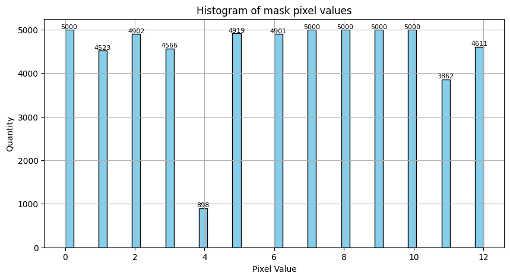
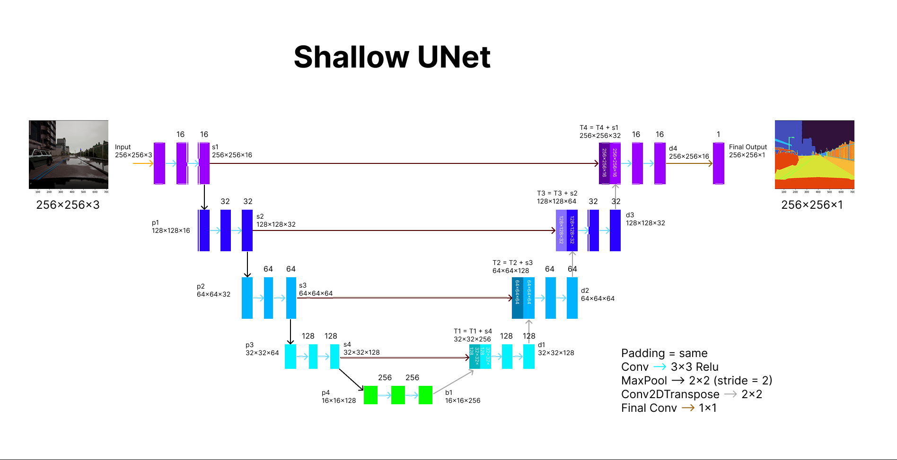
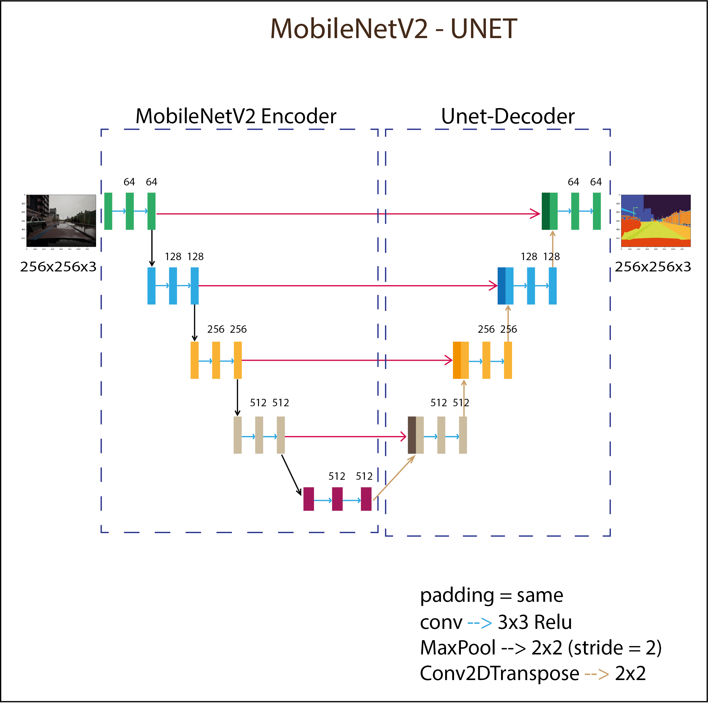
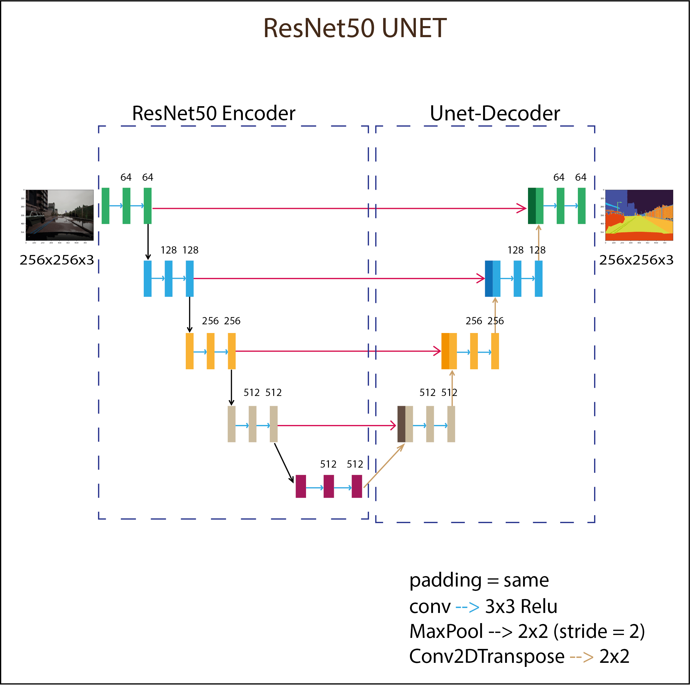
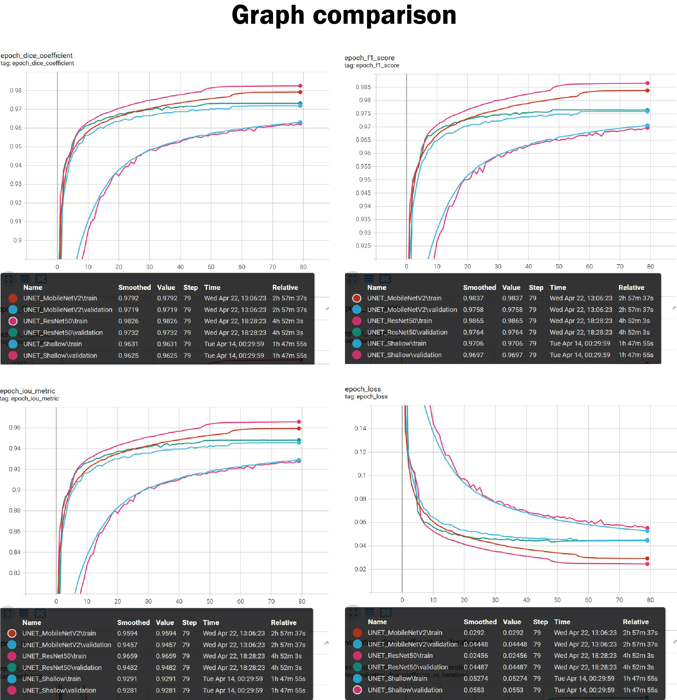
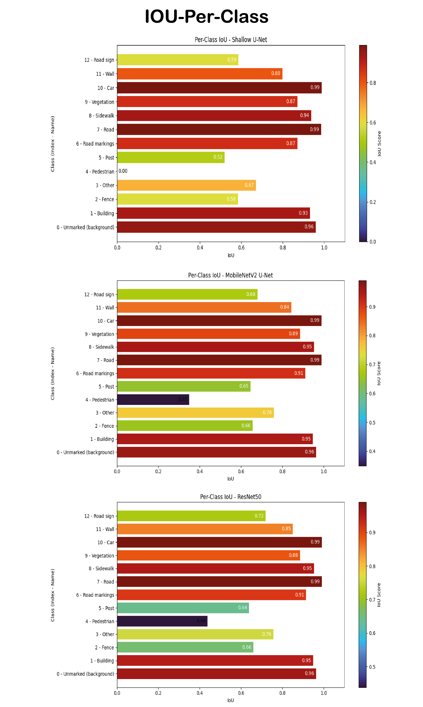
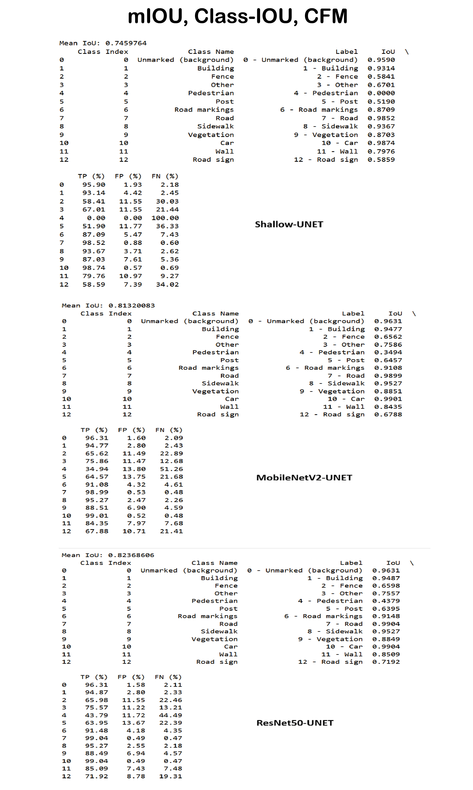
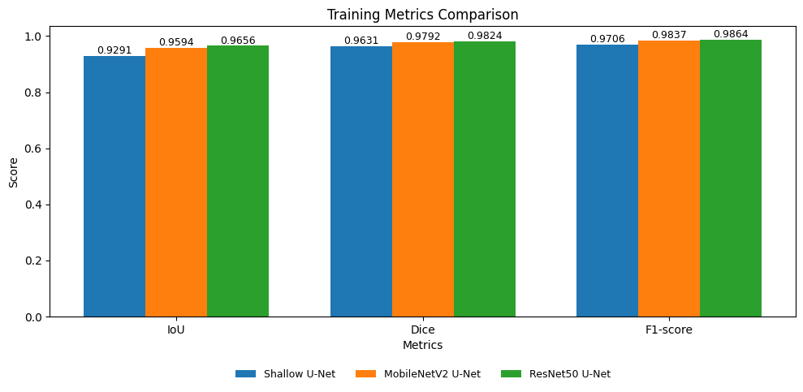
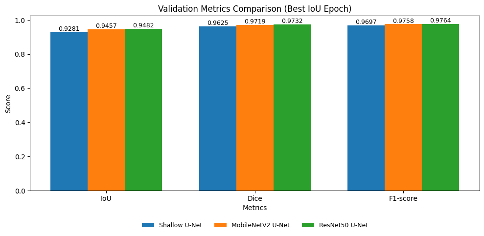

# Semantic Segmentation for Autonomous Driving Using U-Net Architectures

### Dataset Link: 
https://www.kaggle.com/datasets/kumaresanmanickavelu/lyft-udacity-challenge/data
OR
https://datasetninja.com/self-driving-cars#download

# Run the project
```bash
conda create -n your_env_name python==3.8 -y
```

```bash
conda activate your_env_name
```

```bash
git clone https://github.com/MannShrestha/Semantic-Segmentation-For-Autonomous-Driving.git
```

```bash
pip install -r requirements.txt
```
# Data Sample


# Data Distribution


# U-Net Architectures


<table>
  <tr>
    <td align="center" style="padding-right:10px;">
      
    </td>
    <td align="center">
      
    </td>
  </tr>
</table>

# Training curves


# IOU per class




# Train and Validation Comparison
<table>
  <tr>
    <td align="center" style="padding-right:10px;">
      
    </td>
    <td align="center">
      
    </td>
  </tr>
</table>

